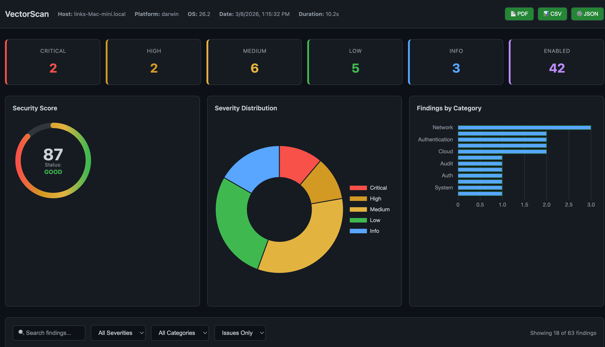

# vectorscan

```
  ██╗   ██╗███████╗ ██████╗████████╗ ██████╗ ██████╗ ███████╗ ██████╗ █████╗ ███╗   ██╗
  ██║   ██║██╔════╝██╔════╝╚══██╔══╝██╔═══██╗██╔══██╗██╔════╝██╔════╝██╔══██╗████╗  ██║
  ██║   ██║█████╗  ██║        ██║   ██║   ██║██████╔╝███████╗██║     ███████║██╔██╗ ██║
  ╚██╗ ██╔╝██╔══╝  ██║        ██║   ██║   ██║██╔══██╗╚════██║██║     ██╔══██║██║╚██╗██║
   ╚████╔╝ ███████╗╚██████╗   ██║   ╚██████╔╝██║  ██║███████║╚██████╗██║  ██║██║ ╚████║
    ╚═══╝  ╚══════╝ ╚═════╝   ╚═╝    ╚═════╝ ╚═╝  ╚═╝╚══════╝ ╚═════╝╚═╝  ╚═╝╚═╝  ╚═══╝
```

> Big brother is always watching. Question everything. Especially the government.



Fast, opinionated system security audit tool. Scans your Mac for misconfigurations, weak defaults, and attack vectors — then tells you exactly what to fix. No agents, no cloud, no telemetry. Just a binary and the truth.

macOS and Linux supported. Windows coming soon.

---

## Quick start

```bash
# Install pre-built binary (macOS, no Go required)
curl -fsSL https://raw.githubusercontent.com/linkvectorized/vectorscan/master/install.sh | bash

# Run
sudo vectorscan

# Without root (partial results, warns you)
vectorscan
```

Or install from source (requires Go 1.21+):

```bash
go install github.com/linkvectorized/vectorscan/cmd/vectorscan@latest
sudo $(which vectorscan)
```

Or clone and build manually:

```bash
git clone https://github.com/linkvectorized/vectorscan
cd vectorscan
go build -o vectorscan ./cmd/vectorscan/
sudo ./vectorscan
```

---

## Output formats

```bash
./vectorscan                        # Table (default) — colored terminal output
./vectorscan -output json           # JSON — pipe to jq, feed to dashboards
./vectorscan -output csv            # CSV — spreadsheets, compliance reports
./vectorscan -output markdown       # Markdown — paste into docs or tickets
./vectorscan -output web            # Browser dashboard — interactive, filterable
./vectorscan -output web -port 3000 # Dashboard on a custom port (default: 8080)
```

---

## Web dashboard

```bash
sudo vectorscan -output web
```

Runs a local HTTP server after the scan and opens your browser automatically.

- **Safe to close the terminal** — server detaches and keeps running in the background
- **Auto-shuts down** when you close the browser tab — no orphaned processes, no cleanup
- Navigate to `http://localhost:8080` manually if the browser doesn't open
- Custom port: `-port 3000`

**Dashboard features:**
- Security score gauge with status (EXCELLENT / GOOD / FAIR / POOR / CRITICAL)
- Severity and category breakdown charts
- Filterable findings table — search by keyword, filter by severity, category, or status
- Issues Only view by default — passing checks hidden unless you want them
- Green arrow on passing checks when viewing all findings
- Export to CSV, JSON, or PDF

---

## What it checks

62 security checks across these categories:

| Category | What it covers |
|----------|---------------|
| **Permissions** | Sudoers, world-writable files, SUID binaries |
| **System** | SIP, Gatekeeper, FileVault, XProtect, firmware, secure boot |
| **Authentication** | Password policy, account lockout, empty passwords, Touch ID for sudo |
| **Network** | Open ports, SSH config, VPN, DNS-over-HTTPS, DNSSEC, Bonjour, weak ciphers |
| **Privacy** | Spotlight telemetry, Siri analytics, Apple analytics, camera/mic access, location services |
| **Persistence** | Launch agents, shell configs, kernel extensions |
| **Logging** | Audit daemon, syslog, crash reporter, log retention |
| **Credentials** | Exposed credential files, git config secrets, SSH key strength |

---

## Scoring

Weighted scoring — critical issues hurt more than low ones. Skipped checks (timeouts, insufficient privileges) are excluded from the score entirely.

| Severity | Weight | Meaning |
|----------|--------|---------|
| CRITICAL | 4 pts | Immediate risk — fix now |
| HIGH | 3 pts | Significant exposure — fix soon |
| MEDIUM | 2 pts | Weak configuration — should address |
| LOW | 1 pt | Hardening opportunity |
| INFO | 0 pts | Informational / passing check |

Every check is worth 4 points max. Passing checks earn full points. Failing checks lose points based on severity. Your score is `earned / max * 100`.

```
3 critical findings: -12 pts
2 high findings:     -6 pts
9 medium findings:   -18 pts
4 low findings:      -4 pts
                     ─────
Total deductions:    -40 pts
Max possible:        220 pts
Earned:              180 pts → 81%
```

---

## What you need

- macOS or Linux
- 10 seconds

---

## License

MIT — free for everyone, forever. Use it, fork it, modify it, share it.

---

*Know your attack surface. Fix it before someone else finds it.*

— [linkvectorized](https://github.com/linkvectorized)
